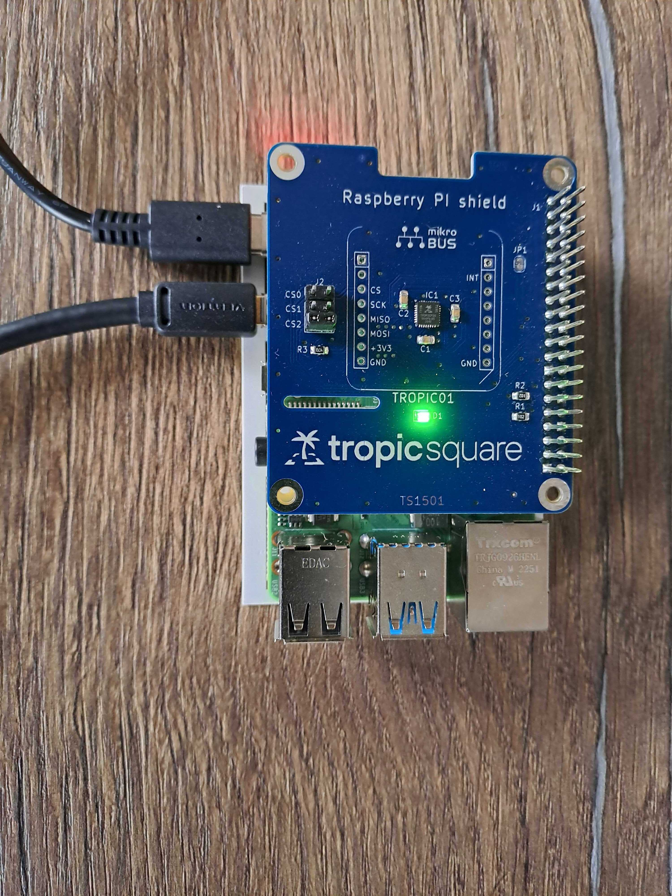
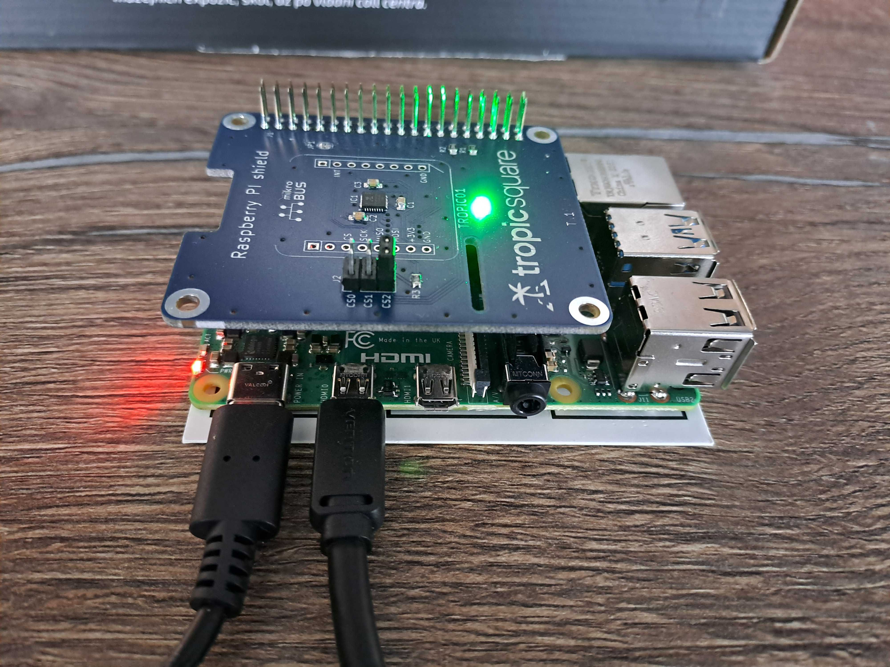

# Linux SPI Tutorial
This port should be compatible with most Linux-based systems with a hardware SPI interface, including popular single-board computers such as the Raspberry Pi. It is compatible with our [Raspberry Pi shield](https://github.com/tropicsquare/tropic01-raspberrypi-shield-hw). Follow the link to get more details about this shield, including schematics, design files, and manufacturing data.

Contents:

- [Linux SPI Tutorial](#linux-spi-tutorial)
  - [First Steps](#first-steps)
    - [Hardware Preparation](#hardware-preparation)
    - [Install Dependencies](#install-dependencies)
    - [System Setup](#system-setup)
    - [Clone the libtropic-linux Repository](#clone-the-libtropic-linux-repository)
    - [Build Examples](#build-examples)
    - [Run a Basic Example: Read CHIP ID and firmware versions](#run-a-basic-example-read-chip-id-and-firmware-versions)
    - [Update Internal Firmware](#update-internal-firmware)
  - [Running Advanced Examples](#running-advanced-examples)
  - [Building Functional Tests](#building-functional-tests)
  - [FAQ](#faq)

## First Steps
> [!IMPORTANT]
> **Do not skip these steps**. You will gather basic information about the chip (which you will need for any eventual support) and update your chip's firmware, which will guarantee compatibility with the latest Libtropic API.

Before proceeding, familiarize yourself with the [Libtropic SDK documentation](https://tropicsquare.github.io/libtropic/latest/).

### Hardware Preparation
As stated above, we recommend using our [Raspberry Pi Shield](https://github.com/tropicsquare/tropic01-raspberrypi-shield-hw).

> [!IMPORTANT]
> On the shield, short the CS2 pins with a jumper.

Your setup should look like the following:





### Install Dependencies
Make sure to have these dependencies installed:

* CMake
  * Raspbian/Debian/Ubuntu: `sudo apt install cmake`
  * Fedora: `sudo dnf install cmake`
* GCC
  * Raspbian/Debian/Ubuntu: `sudo apt install gcc`
  * Fedora: `sudo dnf install gcc`

MbedTLS 4.0.0 which we use in this repository requires:

* Recent Python
* Following Python packages:
  * jinja2
  * jsonschema

The recommended method is to use Python virtual environment to install those packages:
```shell
python3 -m venv .venv
source .venv/bin/activate
pip3 install --upgrade pip
pip3 install jinja2 jsonschema
```

### System Setup
Make sure that you have:

* The SPI kernel module enabled.
    * On Raspberry Pi, you can use `raspi-config` to enable the module.
* Permissions to access the SPI and GPIO interface.
    * On Raspberry Pi, you must be a member of the `spi` and `gpio` groups.

```bash
# Check if you are in the spi and the gpio group
groups
# Add yourself to each group you are not in
sudo usermod -aG spi "$USER"
sudo usermod -aG gpio "$USER"
```

### Clone the libtropic-linux Repository

```bash
git clone https://github.com/tropicsquare/libtropic-linux.git
cd libtropic-linux
git submodule update --init --recursive
cd Linux_SPI/
```

### Build Examples

All examples are implemented in the [Libtropic](https://github.com/tropicsquare/libtropic) repository. For more information about them, refer to the [Examples](https://tropicsquare.github.io/libtropic/latest/get_started/examples/) section in the Libtropic SDK documentation.

Build all examples in one place with the following commands:

```bash
mkdir build
cd build
cmake -DLT_CAL=mbedtls_v4 -DLT_BUILD_EXAMPLES=1 ..
make
```

> [!NOTE]
> `-DLT_CAL` is used to select Cryptography Function Provider. We provide multiple — refer to the [Supported Cryptographic Functionality Providers](https://tropicsquare.github.io/libtropic/latest/other/supported_cfps/) section in the Libtropic SDK documentation.

For each example, a binary will be created in the build directory. Once all examples are built, **continue with the following section**.

### Run a Basic Example: Read CHIP ID and firmware versions
First, it is recommended to run the **lt_ex_show_chip_id_and_fwver** example. This example will print, among other information, the CHIP ID and TROPIC01's firmware versions.

To run this example, execute:
```bash
./lt_ex_show_chip_id_and_fwver
```

Save the output of this example for future reference.

### Update Internal Firmware
After trying out communication and writing down CHIP ID and firmware versions got from the first example, upgrade TROPIC01's internal firmware, as newer versions fix bugs and ensure compatibility with the latest Libtropic SDK.

> [!IMPORTANT]
> - Using outdated firmware is not recommended. Outdated firmware may not be compatible with the latest version of the Libtropic SDK.
> - Firmware updates should be performed only after you saved output from `lt_ex_show_chip_id_and_fwver`.
> - Use a stable power source and avoid disconnecting the devkit or rebooting your computer during the update. Interrupting a firmware update can brick the device.

To update both internal firmware to the latest versions, execute the following example:

```bash
./lt_ex_fw_update
```

After successful execution, your chip will contain the latest firmware and will be compatible with the current Libtropic API.

## Running Advanced Examples

> [!IMPORTANT]
> Make sure you have already run examples from previous sections.

> [!CAUTION]
> Some examples cause **irreversible changes** to the chip. Proceed only after you read the [Examples](https://tropicsquare.github.io/libtropic/latest/get_started/examples/) section in the Libtropic documentation and you understand the consequences. The documentation describes which examples are irreversible and what each example does.

Other examples can be run similarly to the ones you already tried. They are binaries, which you can simply execute.
```bash
./example_binary_name
```

> [!IMPORTANT]
> You may encounter issues with examples that establish a Secure Session — refer to [Establishing Your First Secure Channel Session](https://tropicsquare.github.io/libtropic/latest/get_started/default_pairing_keys/#establishing-your-first-secure-channel-session) in the Libtropic documentation for more information.

## Building Functional Tests

> [!CAUTION]
> **DANGER!** Functional tests are for internal use only and are provided only for reference. Some tests can **destroy** your chip. **Do not run the tests** unless you are absolutely sure what you are doing. If you damage your chip with the tests, we are unable to provide any support.

All functional tests are implemented in the [Libtropic](https://github.com/tropicsquare/libtropic) repository. For more information about them, refer to the [Functional Tests](https://tropicsquare.github.io/libtropic/latest/for_contributors/functional_tests/) section in the Libtropic documentation.

Build all functional tests in one place with the following commands:
```bash
mkdir build
cd build
cmake -DLT_CAL=mbedtls_v4 -DLT_BUILD_TESTS=1 ..
make
```

For each test, a binary will be created in the build directory (similarly as when building the examples).

> [!IMPORTANT]
> You may encounter issues with tests that establish a Secure Session — refer to [Establishing Your First Secure Channel Session](https://tropicsquare.github.io/libtropic/latest/get_started/default_pairing_keys/#establishing-your-first-secure-channel-session) section in libtropic documentation for more information.

We use CTest to run functional tests.

To list available tests:
```bash
ctest -N
```

To launch reversible tests only:
```bash
ctest -R _rev_
```

> [!TIP]
> To see all output, use `--verbose` or `-V`.

## FAQ

If you encounter any issues, please check [here](./../FAQ.md) before filing an issue or reaching out to our [support](https://support.desk.tropicsquare.com/).

> [!IMPORTANT]  
> We do not provide any support for running the tests.